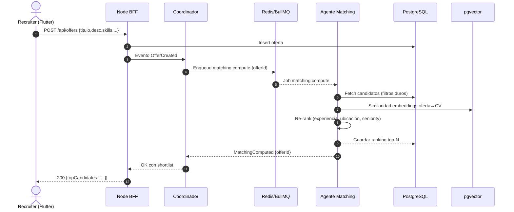
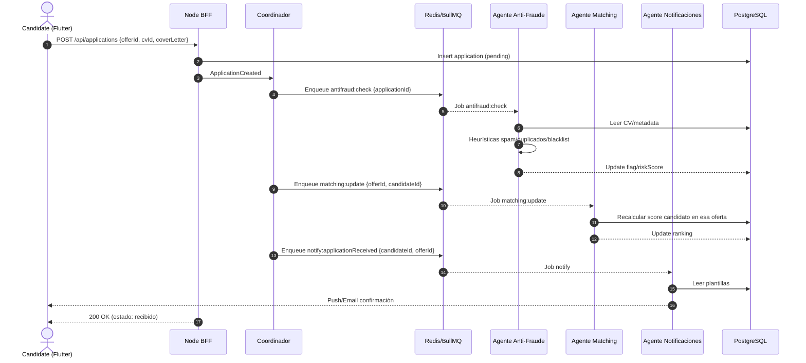
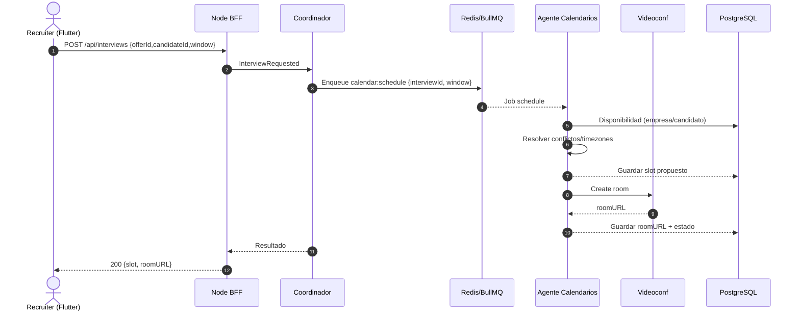

# Infojobs-new – Diagrama funcional del Modo Agente

Documento guía para alinear arquitectura, flujos y convenciones entre el frontend Flutter y los servicios Node.js orquestados por agentes.

## 1. Arquitectura funcional (Flutter + Node.js)

```mermaid
graph TD
  U[Flutter App (Recruiters/Candidates)] -->|REST/JSON| BFF[Node.js API Gateway (Nest/Express)]
  BFF --> AUTH[Auth & IAM (JWT/OAuth2, RBAC)]
  BFF --> COORD[Agente Coordinador]

  subgraph Agents (Node.js services)
    MATCH[Agente de Matching]
    CAL[Agente de Calendarios]
    NOTIF[Agente de Notificaciones]
    FRAUD[Agente Anti-Fraude/Spam]
    ANALYTICS[Agente de Analytics/Insights]
  end

  COORD --> Q[(Redis + BullMQ)]
  Q <---> MATCH
  Q <---> CAL
  Q <---> NOTIF
  Q <---> FRAUD
  Q <---> ANALYTICS

  subgraph Storage
    DB[(PostgreSQL)]
    VS[(pgvector – embeddings)]
    FS[(Object Storage – CVs, adjuntos)]
  end

  BFF --> DB
  MATCH --> DB
  CAL --> DB
  NOTIF --> DB
  FRAUD --> DB
  ANALYTICS --> DB
  MATCH --> VS

  subgraph Integraciones Externas
    CALAPI[Google/Microsoft Calendar]
    MAIL[Email/SMS/Push]
    VC[Zoom/Meet/Jitsi]
    JOBS[Fuentes externas (scrapers/APIs)]
  end

  CAL --> CALAPI
  NOTIF --> MAIL
  CAL --> VC
  MATCH --> JOBS

  subgraph Gobernanza
    POL[Policy/Guardrails]
    OBS[Observability (Logs, Metrics, Traces)]
  end
  COORD --> POL
  BFF --> OBS
  MATCH --> OBS
  CAL --> OBS
  NOTIF --> OBS
  FRAUD --> OBS
  ANALYTICS --> OBS
```

- El BFF centraliza autenticación, validaciones, rate-limits y expone endpoints para la app Flutter.
- El coordinador desglosa objetivos y publica trabajos/eventos en BullMQ.
- Matching combina embeddings (pgvector) con filtros SQL y re-ranking heurístico.
- Anti-fraude detecta patrones de spam (CV clonados, cuentas bot, términos anómalos).
- Analytics agrega métricas (CTR, tiempo a contratación, embudos por empresa/oferta).

## 2. Diagrama de secuencia: Publicar oferta → Matching → Shortlist



## 3. Diagrama de secuencia: Candidato aplica → Screening → Notificación



## 4. Diagrama de secuencia: Programar entrevista E2E



## 5. Endpoints REST (BFF)

- Auth: `POST /api/auth/login` (tokens), `GET /api/auth/me`
- Companies/Recruiters: `POST /api/companies`, `GET /api/companies/:id`, `POST /api/recruiters`
- Candidates: `POST /api/candidates`, `GET /api/candidates/:id`, `POST /api/candidates/:id/cv`
- Offers & Matching: `POST /api/offers`, `GET /api/offers/:id`, `GET /api/offers/:id/candidates?top=50`, `POST /api/offers/:id/match/refresh`
- Applications: `POST /api/applications`, `GET /api/applications/:id`, `PATCH /api/applications/:id/status`
- Interviews: `POST /api/interviews`, `GET /api/interviews/:id`, `POST /api/interviews/:id/reschedule`
- Search/Discovery: `GET /api/search/offers?q=typescript&location=remote&seniority=mid`, `GET /api/search/candidates?q=react&location=madrid`

## 6. Colas (BullMQ) y eventos

- Queues:
  - `matching:compute` → `{ offerId, top }`
  - `matching:update` → `{ offerId, candidateId }`
  - `calendar:schedule` → `{ interviewId, window }`
  - `notify:applicationReceived` → `{ candidateId, offerId }`
  - `antifraud:check` → `{ applicationId }`
  - `analytics:ingest` → `{ event, payload }`
- Eventos (pub/sub lógico): `OfferCreated`, `ApplicationCreated`, `MatchingComputed`, `InterviewScheduled`, `FraudFlagged`

## 7. Contratos JSON (ejemplos)

```json
{
  "event": "OfferCreated",
  "offerId": "ofr_2025_0001",
  "companyId": "cmp_123",
  "ts": "2025-10-16T15:50:00Z"
}
```

```json
{
  "offerId": "ofr_2025_0001",
  "top": 100,
  "filters": {
    "remote": true,
    "languages": ["es", "en"]
  }
}
```

```json
{
  "applicationId": "app_987",
  "signals": ["dup_cv", "keyword_spam"]
}
```

```json
{
  "interviewId": "int_555",
  "window": {
    "days": 7,
    "tz": "Europe/Madrid"
  }
}
```

## 8. Esqueleto de carpetas (monorepo opcional)

```text
infojobs-new/
  apps/
    mobile_flutter/
      lib/
        core/            # dio client, interceptors
        features/
          auth/
          offers/
          candidates/
          applications/
          interviews/
    api_node/
      src/
        main.ts          # Nest bootstrap o Express app
        modules/
          auth/
          companies/
          recruiters/
          candidates/
          offers/
          applications/
          interviews/
          search/
        agents/
          coordinator/
          matching/
          calendars/
          notifications/
          antifraud/
          analytics/
        queues/
          bullmq.ts
      package.json
  packages/
    shared-types/
    shared-config/
  docker/
    docker-compose.yml   # api, postgres, redis
```

## 9. Notas operativas

- Auth: JWT corto + refresh; RBAC por rol (`recruiter`, `candidate`, `admin`).
- Idempotencia: cabecera `Idempotency-Key` en endpoints que encolan jobs.
- Observabilidad: `trace-id`, métricas por cola, auditoría de `applications.status`.
- pgvector: embeddings de ofertas y CV; re-entrenos nocturnos para gestionar drift.
- Anti-fraude: reglas + umbrales; si `riskScore > T`, forzar verificación manual.
- Flutter: dio con interceptores; Bloc/Riverpod; manejo de estados (loading/error/empty/data) y reintentos con backoff.

## 10. Próximos pasos

1. Plantillas Nest/Express con módulos, colas y DTOs alineados a los eventos anteriores.
2. Servicios Flutter listos (dio + interceptores JWT) y pantallas CRUD básicas por módulo.
3. Docker Compose mínimo (API + PostgreSQL + Redis) y scripts de migraciones automatizados.

